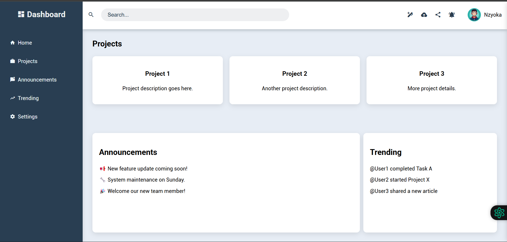

# Project: Admin Dashboard

## Overview

The Admin Dashboard project is a, responsive web application designed for managing and overseeing various tasks, projects, announcements, and trending activities within an organization or platform. 
- It comes with a user-friendly interface and is highly customizable to fit different business needs. 
- The dashboard provides key insights into projects, announcements, trending activities, and a smooth user experience for both desktop and mobile devices.

<!-- preview live link -->
Click to view: [Live project](https://nzyoka10.github.io/admin-dashboard/)
<!-- end preview live link -->

<!-- screenshot -->

<!-- end screenshot -->
